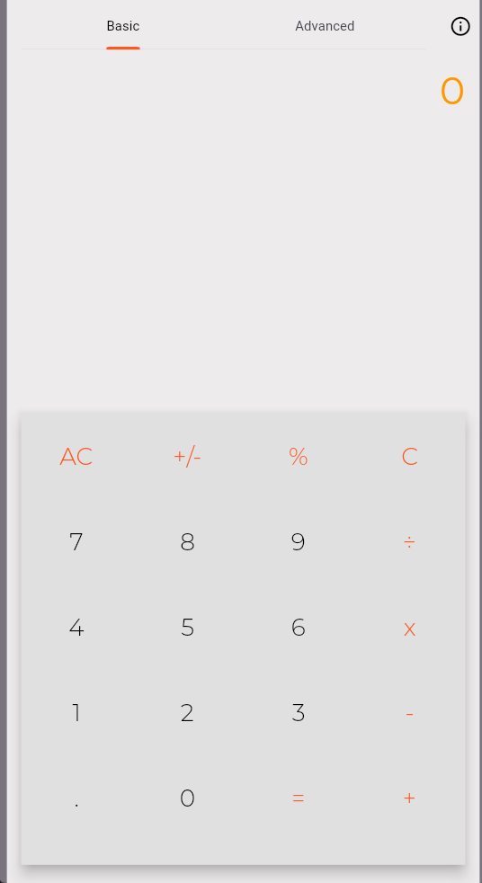

# Flutter Calculator

A simple calculator made with Flutter. This is a PWA (Progressive Web Application) so you can install the app from the website itself. [Visit Website](https://flutter-calculator-app.netlify.app)

## Features
- [x] Can do basic arithmetic operations
- [x] Can do basic percentage calculation
- [x] Can compute chained arithmetic operations
- [x] Follows MDAS rule
- [x] Support for Advanced Mode (Square roots, fractions, etc.)
- [x] Advanced mode uses latex parser to render fancy math expressions

## Project Preview

|Basic Mode|Advanced Mode|
|----------|-------------|
|  |  |


## Platforms tested on

| Platform Type | Is Tested |
|---------------|-----------|
| Android       |  Yes      |
| IOS           |  No       |
| Web           |  Yes      |

## IMPORTANT NOTE

This project uses old version of flutter (`sdk: >=2.12.0 <3.0.0`) as this was **__first built__** 2 years ago. Updating to latest version would probably cause some errors to rise up. You have been warned.

## Building Project

Download dependencies

```
flutter pub get
```

Building for web

```
flutter build web
```

Building for android/ios with shader-warm up bundled

```
# Android
flutter build apk --release --bundle-sksl-path flutter_01.sksl.json

# IOS
flutter build ios --release --bundle-sksl-path flutter_01.sksl.json
```

Generating your own sksl shader warm-up file

```
flutter run --profile --cache-sksl --purge-persistent-cache
```

Trigger as many animations as you can, then when you're done. Press `Shift+M` to generate the recorded sksl to a json file (`flutter_[number].sksl.json`).